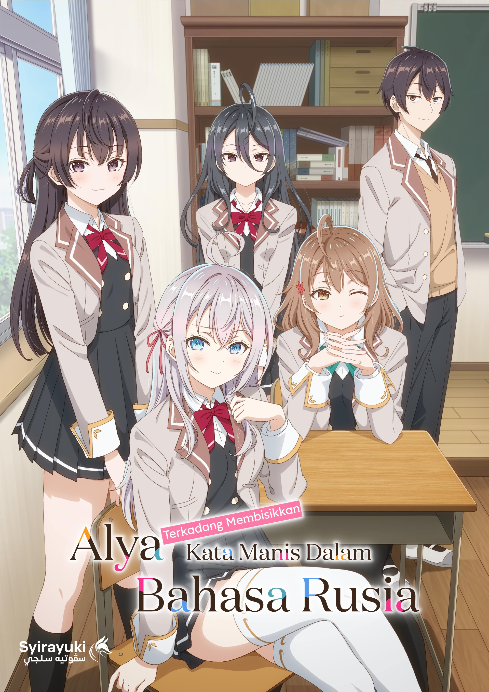
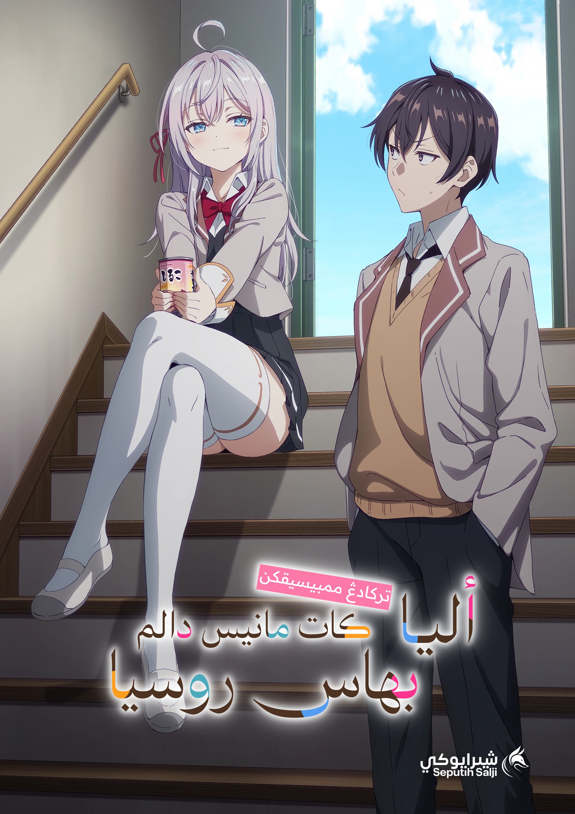

# Tokidoki-Alya
 Sari kata untuk cetera **Terkadang Alya-san Bisikkan Kata Manis Dalam Bahasa Rusia** (Tokidoki Bosotto Roshia-go de Dereru Tonari no Alya-san) 

|                            |                            |
|:--------------------------:|:--------------------------:|
|  |  |

## Struktur folder
```
Grafik/
├── Poster jpg
└── Logo svg
01/
├── [RUMI] 01 - Tokidoki Alya.ass
├── [RUMI-KFX] 01 - Tokidoki Alya.ass
├── [RUMI-ED] 01 - Tokidoki Alya.ass
├── [JAWI] 01 - Tokidoki Alya.ass
├── [JAWI-KFX] 01 - Tokidoki Alya.ass
├── [JAWI-KFX] 01 - Tokidoki Alya v1.1.ass # Bubuh versi jika ada.
└── [JAWI-ED] 01 - Tokidoki Alya.ass
```

Tiada versi dibubuh bermaksud 1.0, maka jika dibubuh versi, hendaklah dibubuh bermula 1.1 dan seterusnya.

Penomboran versi adalah mengikut kaedah sehampir [semantic versioning](https://semver.org/), iaitu MAJOR.MINOR.PATCH

| Tahap Versi | Keterangan                                                                 |
|-------------|-----------------------------------------------------------------------------|
| **MAJOR**   | Perubahan besar seperti terjemahan semula keseluruhan sari kata.           |
| **MINOR**   | Perubahan kecil seperti pengubahsuaian atur huruf atau format.             |
| **PATCH**   | Pembetulan kecil seperti pembetulan ejaan atau perubahan warna teks.       | 


Benda ni tak wajib pun, boleh jadi kerana ada perubahan yang besar tetapi tidak mahu membuang terus fail asal 1.0. Ini sekadar garis panduan dan nak menjadikan tempat simpanan ni nampak gempak ala developer berkaliber hahaha.
